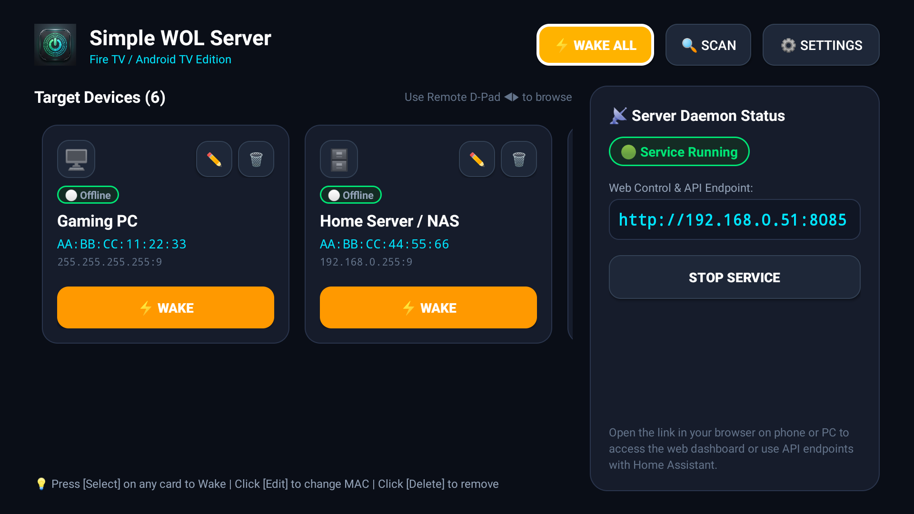
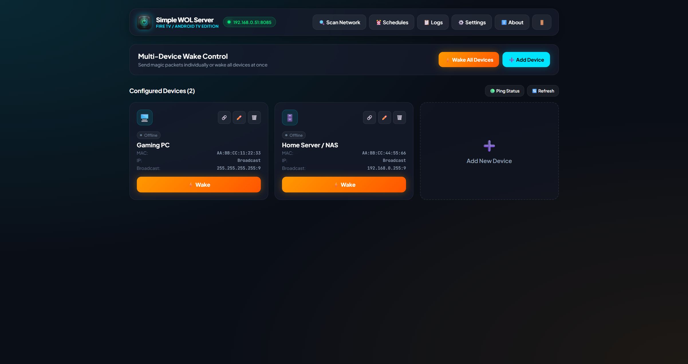
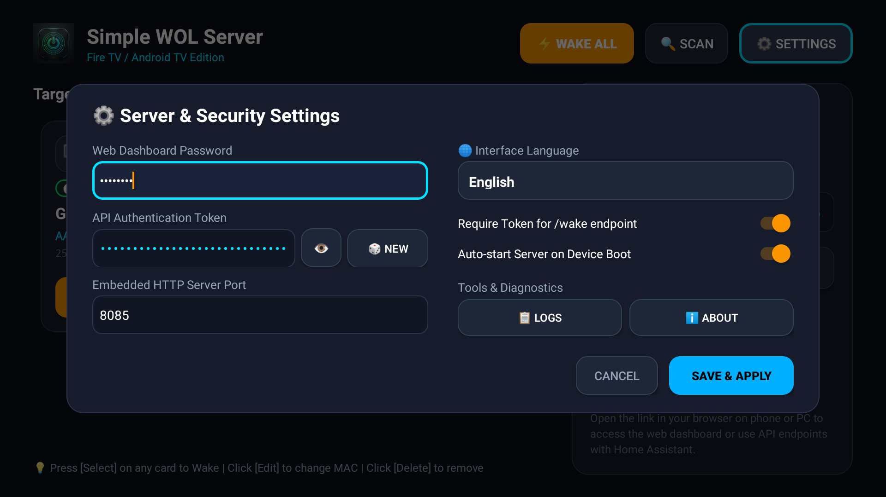
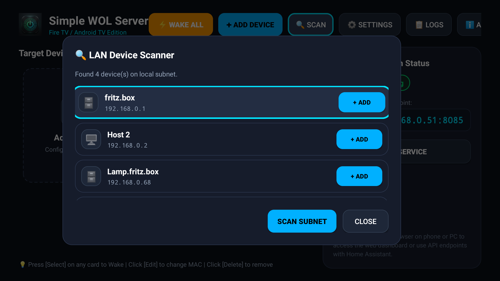

# Simple WOL Server (Fire TV / Android TV Edition)

[](https://github.com/vtstv/WOLServer/releases)
[](https://developer.amazon.com/appstore)
[](LICENSE)
[](https://kotlinlang.org)

Lightweight Wake-on-LAN (WoL) daemon, multi-device management hub, and embedded REST API server engineered specifically for **Amazon Fire TV**, **Android TV**, and Android-based smart displays.

It operates as an uninterrupted foreground service hosting an embedded **NanoHTTPD** HTTP server and a modern glassmorphic web control dashboard, enabling users to wake PCs, servers, NAS units, and consoles via remote D-pad, web browser, or home automation platforms (*Home Assistant*, *Apple Shortcuts*, *Node-RED*).

---

## Screenshots & User Interface

### Fire TV & Android TV 10-Foot Experience
Intuitive TV remote D-pad navigation, high-contrast dark theme, live ICMP/TCP ping status indicators, and one-click Wake action:



---

### Embedded Web Control Dashboard
Accessible directly in any browser on your phone, tablet, or PC via local network (`http://<DEVICE_IP>:8085`):



---

### TV Settings, Auto-Scan & Diagnostics

| 2-Column TV Settings Modal | LAN Subnet Scanner & Auto-Discovery |
| :---: | :---: |
|  |  |

---

## Key Features

- **Multi-Device Wake-on-LAN**: Manage multiple target devices with custom names, MAC addresses, broadcast addresses, UDP ports (7/9), and device categories (Desktop, Server, Laptop, Console, TV).
- **10-Foot Leanback UI**: Fully optimized for TV remote D-pad navigation with distinct focus states, safe overscan margins, and dark mode palette.
- **Embedded Web Dashboard**: Modern responsive glassmorphic web control panel for desktop and mobile browsers on the local network.
- **Live Device Status Prober**: Dual-mode availability checking utilizing ICMP ping with automatic fallback to TCP socket probes (ports 3389, 22, 445, 80, 8080) for Windows hosts that drop ICMP.
- **LAN Subnet Scanner**: Discovers active devices, IP addresses, and hardware MAC addresses on the local network via kernel ARP table parsing.
- **Autonomous Auto-Wake Scheduler**: Background timer evaluating custom wake schedules by day-of-week, hour, and minute with duplicate execution prevention.
- **Ready-to-Use Integration Generator**: One-click configuration export for Home Assistant (`rest_command` and `template switch`), Apple Shortcuts (Webhook), cURL, and Python.
- **Configuration Backup and Restore**: Complete JSON export and import for devices, schedules, and server settings.
- **Localization**: Full support for English, German (Deutsch), and Russian (Русский), with automatic system language detection.
- **24/7 Background Operation**: Foreground service with partial wake lock and Wi-Fi lock support for uninterrupted operation during device standby.

---

## Installation

### Requirements
- Amazon Fire TV (Fire OS 5+) or Android TV (Android 5.1 / API 22 or higher).
- Device connected to the same local area network (LAN) as the target machines.

### Deploying via ADB
```bash
# Connect to your Fire TV / Android TV device
adb connect <DEVICE_IP>:5555

# Install the release APK
adb -s <DEVICE_IP>:5555 install -r SimpleWOLServer-v2.0.0-release.apk

# Launch the application
adb -s <DEVICE_IP>:5555 shell am start -n com.vtstv.wolserver/.MainActivity
```

---

## REST API Reference

The embedded HTTP server listens on port `8085` by default (`http://<DEVICE_IP>:8085`).

### Authentication
When authentication is enabled (`requireAuthentication: true`), API requests must include the authentication token using one of the following methods:
- **HTTP Header**: `Authorization: Bearer <AUTH_TOKEN>`
- **Query Parameter**: `?token=<AUTH_TOKEN>`

### Endpoints

| Endpoint | Method | Auth Required | Description |
| :--- | :--- | :--- | :--- |
| `/` | `GET` | Form Login | Web Control Dashboard |
| `/health` | `GET` | No | Liveness probe returning server status and runtime statistics |
| `/wake` | `GET` / `POST` | Yes | Broadcasts magic packet. Accepts `id=<device_id>`, `mac=<mac_address>`, or wakes all |
| `/api/devices` | `GET` | Yes | Returns list of configured devices |
| `/api/devices` | `POST` | Yes | Creates or updates a device record |
| `/api/devices` | `DELETE` | Yes | Deletes a device by `?id=<device_id>` |
| `/api/devices/status` | `GET` | Yes | Returns live online/offline status and latency for configured devices |
| `/api/scan` | `GET` / `POST` | Yes | Performs LAN subnet ARP scan and returns discovered devices |
| `/api/schedules` | `GET` | Yes | Returns list of configured auto-wake schedules |
| `/api/schedules` | `POST` | Yes | Creates or updates an auto-wake schedule |
| `/api/schedules` | `DELETE` | Yes | Deletes a schedule by `?id=<schedule_id>` |
| `/api/backup` | `GET` | Yes | Exports complete configuration, devices, and schedules as JSON |
| `/api/restore` | `POST` | Yes | Imports and restores configuration from JSON payload |
| `/config` | `GET` | Yes | Returns current server settings (sanitized) |
| `/config` | `POST` | Yes | Updates server configuration |
| `/logs` | `GET` | Yes | Returns server system and wake event logs |

---

## Home Automation Integrations

### Home Assistant (`configuration.yaml`)

```yaml
# REST Commands
rest_command:
  wake_workstation:
    url: "http://192.168.0.51:8085/wake?id=3f53730d-37ee-4dfe-a37d-bb4645244b39"
    method: "POST"
    headers:
      Authorization: "Bearer YOUR_AUTH_TOKEN"

# Template Switch Entity
switch:
  - platform: template
    switches:
      workstation_power:
        friendly_name: "Workstation"
        value_template: "{{ is_state('binary_sensor.workstation_ping', 'on') }}"
        turn_on:
          service: rest_command.wake_workstation
        turn_off:
          service: notify.notify
          data:
            message: "Manual shutdown required"
```

### Apple Shortcuts (Webhook)
1. Add a **Get Contents of URL** action in Apple Shortcuts.
2. Set URL: `http://192.168.0.51:8085/wake?id=<DEVICE_ID>&token=<AUTH_TOKEN>`.
3. Set Method: `POST`.

### Python
```python
import requests

url = "http://192.168.0.51:8085/wake"
headers = {"Authorization": "Bearer YOUR_AUTH_TOKEN"}
params = {"id": "3f53730d-37ee-4dfe-a37d-bb4645244b39"}

response = requests.post(url, headers=headers, params=params, timeout=5)
print(response.json())
```

---

## Building from Source

### Prerequisites
- JDK 17
- Android SDK (API Level 35)

### Build Commands
```bash
# Clone the repository
git clone https://github.com/vtstv/WOLFireTV.git
cd WOLFireTV

# Execute unit tests
./gradlew test

# Assemble release APK
./gradlew assembleRelease

# Assemble debug APK
./gradlew assembleDebug
```

---

## License & Author

- **Author**: Murr ([https://github.com/vtstv](https://github.com/vtstv))
- **Repository**: [https://github.com/vtstv/WOLServer](https://github.com/vtstv/WOLServer)
- **License**: MIT License
